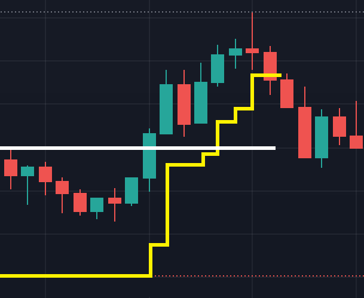

# dynamic-trailing-stop-loss
An experiment on trading crypto using self adjusted trailing stop loss method.

## Requirements

The following Python packages are required and can be installed using pip install -r requirements.txt:

- Flask
- PyBit
- telethon

## Configuration

The bot's configuration is defined in the config.yml file. An example file with the required fields is provided in config.example.yml. The configuration file contains the user data for the Binance API, such as the API key and secret, as well as the setup for strategy parameters, including the wallet percentage, long and short leverage, among other parameters.
One of the major purposes when writing this bot was the ability to receive telegram signals. The Telegram API as well as the configuration of the channels/groups that the bot should be listening to are configured on config.yml as well.

## Usage

To start the application, run **python main.py** in the terminal. The application will start to listen for the upcoming telegram messages. On the first functional tests, I have configured a second telegram account, white-listed the userId that will be sending the messages and proceed from there whitelisted more and more channels that were providing trading signals for the bot to digest.

## Architecture:

The BinanceExchange class provides the methods to buy, sell, check positions, etc.
Once a trading signal is received, it is passed to a decoder. If the decoder was able to interpret the trade signal, a trade object is created and the BinanceExchange is used to open a trade.
All the trades are managed by the ExchangeMediator. The mediator will query Binance from time to time to check on trades. The trade information from the exchange is broadcasted internally. Every trade has a strategy and reacts according to the new values (price action).

## Strategy

In the following image, an example of the bot's operation is presented. The white line represents the entry of a new long/buy trade, and the yellow line represents the stop-loss.

The stop-loss will never be lowered from its previous value, meaning that it can only follow the price action in the desired direction. The goal is for the stop-loss to capture the price action to exit more trades in profit. In the example below, the stop-loss follows the price action in the upward direction. A multiplier can be set in the configuration; by default, the stop-loss moves 1.75 times more in the upward direction than the price action, capturing the trade. The stop-loss can never surpass the current mark price, and a gap can also be configured in the config.yml file. The price action can continue to rise in our favor; once it starts to decrease, the stop-loss will be triggered, resulting in a profitable exit. Of course, we are discussing the best-case scenario here.

It is your responsibility to decide how to use this code. This is not financial advice. I have had many trades close with a profit, but I have also had trades where the stop-loss did not move, hitting its lower limit, and these trades are costly. I cannot guarantee that this approach works; it's an experiment.

